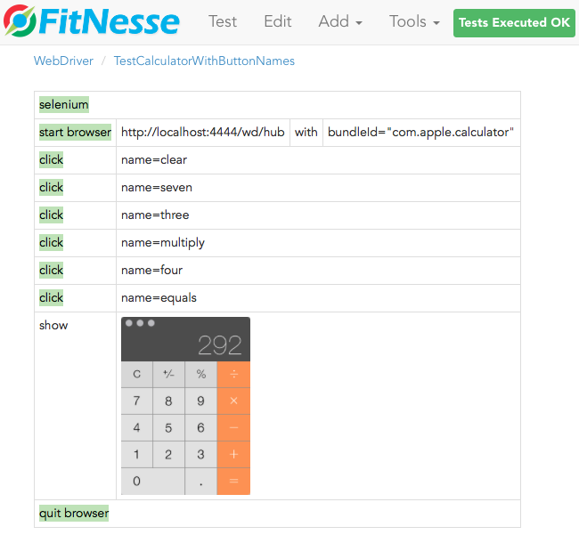
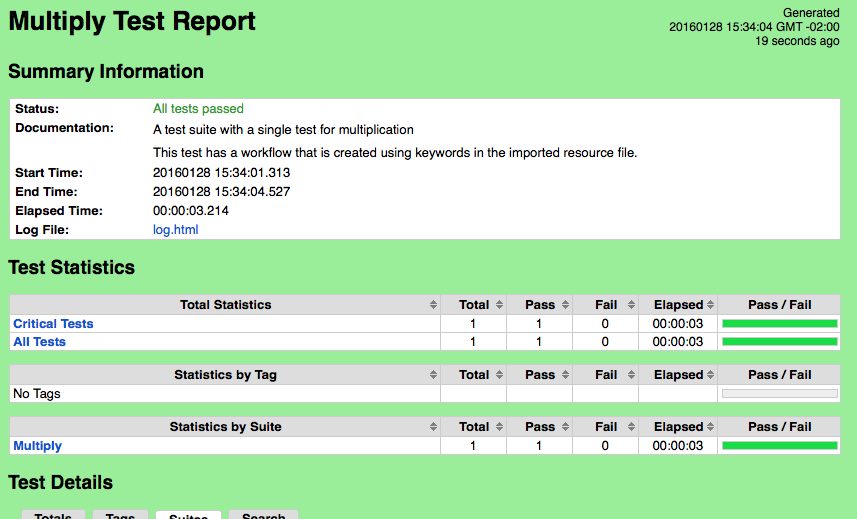

webdriver-python
================

This is an experiment to implement a [Selenium Remote WebDriver](https://w3c.github.io/webdriver/#list-of-endpoints) in Python, to enable a remote
client in Selenium to drive native Desktop apps (say the Calculator). 

Under MacOS we use the atomac library.


#### Install


* git clone <this repo>; cd webdriver-python
* virtualenv env
* source ./env/bin/activate

##### Then, if MacOS, do this
* xcode-select --install
* pip install -U pyobjc-core
* pip install -U pyobjc

##### Then, if Windows, do this
* Install PyWin32: https://sourceforge.net/projects/pywin32/files/pywin32/Build%20219/

##### Then, do this (all platforms)

Install the remaining requirements:

* pip install -r requirements.txt


#### Run

##### Webdriver Server
* python rest_server.py
* http://localhost:4444/ping

You should be able to see something like this: {"time": "2015-05-07T12:21:30.208824"}
Now you can use this server as a Remote Web Driver for your apps.

##### Testing with FitNesse
Build first:

```
./gradlew installDist
```

then run a FitNesse server (with the webdriver already running, per steps above):

```
./build/install/webdriver-python/bin/webdriver-python -p 7070
```

then run a test from FitNesse: http://localhost:7070/WebDriver

You should see test results like this:



##### Testing with RobotFramework

Install first:

```
pip install robotframework
pip install robotframework-selenium2library
```

then run (with the webdriver already running, per steps above):

```
robot Robot/multiply.robot 

```
You should see test results like this:




#### Thank you!

Special thanks to [Softplan](http://www.softplan.con.br) for sponsoring this project/experiment. In particular, the people below:
  
  * Anderson Soffa for the support.
  * André Albino Pereira for the [FitNesse Selenium slim fixture](https://github.com/andreptb/fitnesse-selenium-slim)
